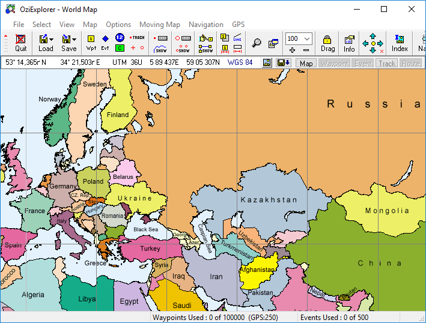

# gt-ozi
[](https://travis-ci.org/nikolaybespalov/gt-ozi)
[](https://www.codacy.com/app/nikolaybespalov/gt-ozi)
[](https://www.codacy.com/app/nikolaybespalov/gt-ozi)
[](https://maven-badges.herokuapp.com/maven-central/com.github.nikolaybespalov/gt-ozi)

GeoTools plugin that allows you to use [OziExplorer](http://www.oziexplorer3.com/) spatial reference file(.MAP) in your Java application.



It's as easy as reading any other map file
```
    File mapFile = new File("World.map");
    
    AbstractGridFormat oziFormat = GridFormatFinder.findFormat(mapFile);

    AbstractGridCoverage2DReader oziReader = oziFormat.getReader(mapFile);
    
    GridCoverage2D coverage2D = oziReader.read(...);
```
Just add dependency to your _pom.xml_
```xml
    <dependency>
        <groupId>com.github.nikolaybespalov</groupId>
        <artifactId>gt-ozi</artifactId>
        <version>${geotools.ozi.version}</version>
        <scope>runtime</scope>
    </dependency>
```
Or to your _build.gradle_
```
    dependencies {
        runtime("com.github.nikolaybespalov:gt-ozi:${geotools.ozi.version}")
    }
```
And your project will be able to work with .MAP files!

~~The main idea is to parse the projection parameters from .MAP file and provide them to WorldImageReader.~~

The code is based on the implementation of the OZI dataset support in GDAL.

## Key difference
- Support for maps crossing the world border by longitude

## Supported projections
- Latitude/Longitude
- Mercator
- Transverse Mercator
- (UTM) Universal Transverse Mercator
- ~~(BNG) British National Grid~~
- ~~(IG) Irish Grid~~
- ~~(NZG) New Zealand Grid~~
- ~~(NZTM2) New Zealand TM 2000~~
- ~~(SG) Swedish Grid~~
- ~~(SUI) Swiss Grid~~
- ~~(I) France Zone I~~
- ~~(II) France Zone II~~
- ~~(III) France Zone III~~
- ~~(IV) France Zone IV~~
- Lambert Conformal Conic
- ~~(A)Lambert Azimuthual Equal Area~~
- ~~(EQC) Equidistant Conic~~
- Sinusoidal
- ~~Polyconic (American)~~
- Albers Equal Area
- Van Der Grinten
- ~~Vertical Near-Sided Perspective~~
- ~~(WIV) Wagner IV~~
- ~~Bonne~~
- ~~(MT0) Montana State Plane Zone 2500~~
- ~~(ITA1) Italy Grid Zone 1~~
- ~~(ITA2) Italy Grid Zone 2~~
- ~~(VICMAP-TM) Victoria Aust.(pseudo AMG)~~
- ~~(VICGRID) Victoria Australia~~
- ~~(VG94) VICGRID94 Victoria Australia~~
- ~~Gnomonic~~
- ~~State Plane Coordinate System~~

## Supported datums
All datums from the [list](http://www.oziexplorer3.com/namesearch/datum_list.html) are supported.

## Supported ellipsoids
All ellipsoids from the [list](http://www.oziexplorer3.com/eng/help/userdatums.html) are supported.

## What about the .ozf2/.ozf3?
Look at [imageio-ozf](https://github.com/nikolaybespalov/imageio-ozf) library.
